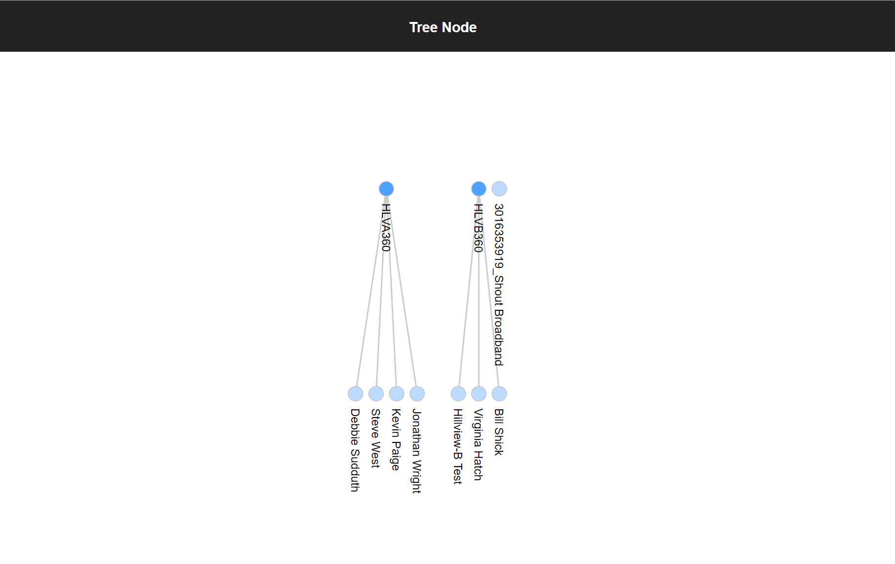

# D3 Data Visualisation (with React)

A react application to visualise a tree node. Build with d3js.org without external packages. A demo version can be found here: https://codesandbox.io/s/w74no37y1k



## Installation

To start the application, run the following commands:

```
> git clone https://github.com/danielchengml/d3-tree-node-native
> cd d3-tree-node-native
> npm i
> npm start
```

The application will now be running on `localhost:3000`

## Built With

* ReactJS - The Front End Framework Used
* NPM - Dependency Management

## Versioning

1.0.0

## Authors

* Daniel C Lean - [github.com/danielchengml](github.com/danielchengml)

## Licence

This project is licensed under the MIT License
